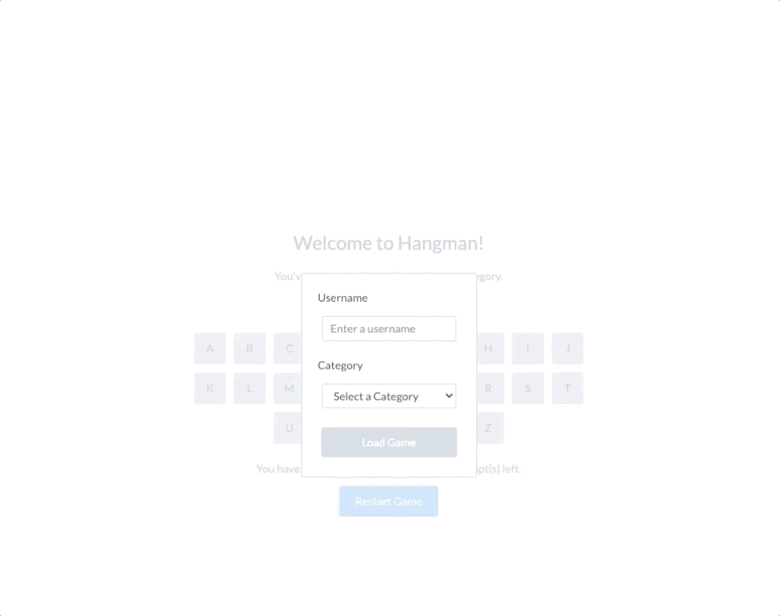

# Front-end Track

The client-side of this Hangman application is built using React. If you're new to React, you can think of it as a framework for our UI - it relies on JavaScript / TypeScript, HTML, and CSS / SCSS to populate and style the page, and is not a new language. While React knowledge is helpful, it is _not_ a prerequisite for this exercise, and the information in [React Fundamentals](#react-fundamentals) below covers the basic concepts you'll see in our code.

The currently rendered page is determined by `src/pages/index.tsx`. For the front-end exercise, you can press on `Front-end Exercise`, which leads you to [http://localhost:3000/frontend](http://localhost:3000/fronted). This is built using `src/pages/frontend/index.tsx`. From here, you can choose to do the application in TypeScript or in JavaScript, and the resulting page is your home page for the exercise. This will either be `src/pages/frontend/ts-version.tsx` or `src/pages/frontend/js-version.tsx`. All of the client-side is built for either of these options, and you should choose whichever you're more comfortable with. You can go to the file to see what's currently being rendered, depending on the state of the application.

## Exercises

The first exercise will help you get familiar with React and using the API, and requires fewer changes. The second exercise will let you get more creative to meet the goal. Feel free to approach any of the exercises however you like, whether that means refactoring any existing code or writing new files.

1. Unfortunately, there's a category (Animals) with no phrases yet. Our application should be able to gracefully handle such errors and notify the user.

    **Task: In `src/utilities/constants` / `src/utilities-js/constants`, there's an existing success notification. Create a similar error notification for this situation. In `src/pages/frontend/ts-version.tsx` / `src/pages/frontend/js-version.tsx`, look for the marker in the code for `Front-end Exercise 1`. Update the `useEffect` hook to recognize errors when trying to get a phrase, using `randomPhraseStatus`. Show the error notification when necessary.**

    *Hint: I wonder what the Notification component on our home page is for...*

    When you're done, it should look something like this:

    

2. Users would like to be able to add their own phrases to categories as well. We already have the API endpoint to be able to do this, but we need to call it.

    **Task: Add a button that prompts users to create a phrase and select the category it should belong to. Communicate with the API to generate this new phrase in our data. You can draw inspiration from the way we load the game. Make sure that the letter grid is not inadvertently getting pressed while you create a new phrase.**

    *Note: The endpoint is POST `/api/phrases`, and we want to pass in a `PhrasePostModel` - that type already exists and you can pull it from `src/server/models`. You can create the phrase with the `difficultyLevelId` set to 1.*

    When you're done, it should look something like this:

    

## Background Information

You are free to modify any files as you see fit. There are three locations you specifically need to know about:

- `src/pages/frontend/ts-version.tsx` / `src/pages/frontend/js-version.tsx` - This page is the page rendered when you go to [http://localhost:3000/frontend](http://localhost:3000/frontend) - the hangman application for the front-end exercises.
- `src/components` / `src/components-js` - React uses components as basic building blocks. These are no different from HTML tags like `div` or `button`, and are simply custom versions with some styling or logic that is often repeated. The components for hangman are housed in this folder, and components are described in more detail below.
- `src/utilities` / `src/utilities-js` - You won't be spending much time in this folder, but it contains a few useful functions and constants. Much of the code in this folder can be treated as a black box, and we will point you to it if you need to change something in the folder.

### React Fundamentals

If you're unfamiliar with React, we've added information on two concepts below that often show up in the code.

#### **Components**

Along with standard HTML elements, you will often see custom elements defined within the JSX code (HTML in JavaScript). These are React components, and are custom components that are no different from the standard HTML tags. The primary goal with these components is to provide repeatable logic and styling. For our application, most are housed within `src/components`.

Take a look at our components to understand how they're built and used. We've written some basic components for consistency across the app, such as `CTButton`, `CTText`, etc.

#### **Hooks**

React is built with "hooks". While these can seem tricky or complex, you can largely treat them as standard functions. These are the main functions you'll run into:

1. `const [state, setState] = React.useState<Type>(initialValue)` - the `useState` hook returns a `state` variable, which is initially set to the `initialValue`, and a `setState` function to update the `state` variable (do not update it directly). We do this instead of directly declaring a variable because React will re-render the page when any `state` has changed. If you'd like, you can learn more about `useState` [here](https://reactjs.org/docs/hooks-state.HTML).

2. `React.useEffect(() => ..., [dependencies])` - the `useEffect` hook takes in a function and `dependencies`, which is a "dependency array" of variables. Whenever any variables in the dependency array are updated, React will execute the function. `useEffect` can be useful if you're trying to execute logic based on another variable being updated (such as updating state after an async call changes some other variable). If you'd like, you can learn more about `useEffect` [here](https://reactjs.org/docs/hooks-effect.HTML).

3. `const { data, error, status, makeHttpRequest, reset } = useAsync<TReturn, TParams, TBody>()` - the `useAsync` hook is a custom hook we've written to simplify API calls. You can pass in types for the data and request, and will be able to make, track and reset request information using the returned values. Specifically, after calling `makeHttpRequest` or `reset`, the other values will automatically update as the API request is processed or the data is reset. There are examples showing how this code is used in `src/pages/frontend/ts-version.tsx` / `src/pages/frontend/js-version.tsx`, and you can also see the documentation in `src/utilities/hooks.ts` / `src/utilities-js/hooks.ts`.

Feel free to look through `src/utilities/hooks.ts` / `src/utilities-js/hooks.ts` to discover any more hooks you may find useful, and you can also view the [React documentation](https://reactjs.org/docs/hooks-overview.HTML) if you'd like to learn more about hooks.

### Styling

Our styling is done through SCSS modules defined for each component (if they need one) in `src/styles`. We import these style modules and assign appropriately to an HTML element like this: `

`

You shouldn't need to worry about styling too much if you are building on top of our pre-built components. But these style modules are available to you and you can always add additional styling as you see fit.

### Debugging

You can use a browser inspector for debugging. You can `console.log` statements out to the console, explore the currently rendered elements, and view network traffic.

While not necessary, you can download [React Developer Tools from the Google Chrome Store](https://chrome.google.com/webstore/detail/react-developer-tools/fmkadmapgofadopljbjfkapdkoienihi?hl=en) if you'd like to.
